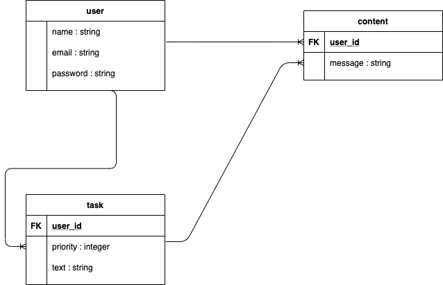

# README

# アプリケーション名
タスク・マスター

# アプリケーション概要
タスクの実行をお手伝いするアプリです。事前に決めたタスクを実施できていれば、事前に投稿しておいたお気に入りの画像が呼び出され、タスク達成を祝福してくれます。時々このアプリはあなたに嘘をついていないか聞いてきます。もしも嘘を付いていると怖い画像とお叱りのメッセージが表示されます。デフォルトで設定されている画像を探していくことも楽しみの1つです。楽しみながら努力を積み上げていきましょう。

# URL
https://task-28412.herokuapp.com/

# テスト用アカウント
BASIC認証  
ユーザー名：tomoshi  
パスワード：41029  

# 利用方法
①タスクを入力してください。  
②画像とメッセージを入力してください。  
③タスクの詳細画面から実施できたか回答するページに遷移してください。「YES」「NO」で回答してください。  
④各々の回答に応じた画像とメッセージが表示されます。次へボタンでトップページに遷移します。  

＊注意
「YES」と答えると、一定の確率で「嘘を付いてますね？本当に達成できましたか？」というメッセージが表示されます。再度「YES」を選択するとトップページに戻り、「NO」を選ぶとデフォルトで指定した怖い画像が表示されお叱りのメッセージが表示されます。再確認の「YES」回答でも低確率で特別な画像とメッセージが表示されます。  

# 目指した課題解決
何らかの目標に向かって努力している人を対象にしています。特に中高生等の受験生を想定したアプリです。
タスクを設定し実施することで、その人が達成すべき目標を成し遂げることをサポートします。
タスク実施のうえで必要なことは2点であり、「楽しく継続」と「実行力の担保」が重要と考えています。
「楽しく継続」する為に、ユーザーは自分の好きな芸能人等の画像を選択し、頑張った後にかけてほしい言葉を複数事前に設定しておくことでユーザーが楽しくタスクを取り組めるように工夫しています。「実行力の担保」の為に、本当にタスクを完了できたか一定の確率で質問されます。これによりタスク完了に対する回答をする時に緊張感が生まれ、タスクの実行力が担保されています。

# 洗い出した要件
実装済の機能
ユーザー登録機能  
タスク入力  
タスク編集、削除  
画像及びメッセージの入力  
画像及びメッセージの編集及び削除  
herokuの画像リンク切れの防止  
タスク実行時「YES」回答の時に表示される画像とメッセージの確率設定  
タスク実行時「YES」回答の時に確率でタスク実行再確認ページへ遷移する確率設定  
タスク実行時「NO」回答の時に表示される画像とメッセージの確率設定  

# 実装予定の機能
10月9日頃まで  
検索機能や表示順の切替機能の実装  

10月16日頃まで  
SNSアカウントで登録やログインができる機能の実装  
一括削除機能の実装  

10月23日頃まで  
フォローしている人のタスク実施についてタイムラインに表示される  
フォローしている人のタスク実行状況について「いいね」ができる  
フォローしている人にコメントすることができる  

# データベース設計

# このアプリの問題点と改善案
時間の許す限り随時改善して参ります。
1.自分で投稿した画像とメッセージがレスポンスとして返ってくるだけでは、モチベーションが低下する    
→デフォルトで用意した画像を充実させる。  
2.グループやフレンド機能がない為、1人で利用することが前提となっている  
→フレンド等で「いいね！」を送ったりコメントができるようにする。  
3.投稿したタスクや画像が多くなりすぎると、編集や削除が大変  
→検索機能実装、一括削除機能実装で解決できる。
4.デフォルト画像が少ない。
→時間の許す限り追加していきます。  
5.投稿した画像データのランダム取得について、自分で確率を設定できない  
→実装方法が分かっていない為、分かり次第実装します。
6.タスク達成率の表示ができない  
→1回目及び2回目のYES回答、NO回答をカウントして数値化したうえでクリック毎にデータを格納しグラフで表示する機能を実装する  
→実装方法が分かっていない為、分かり次第実装します。

